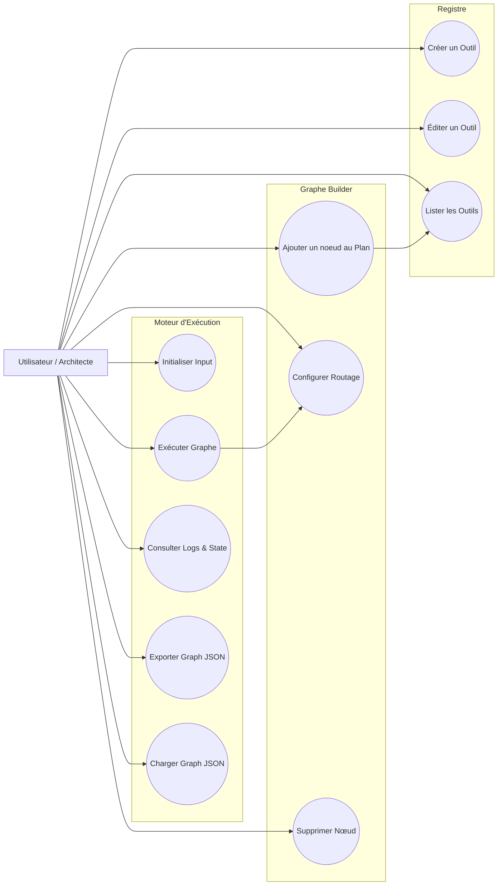
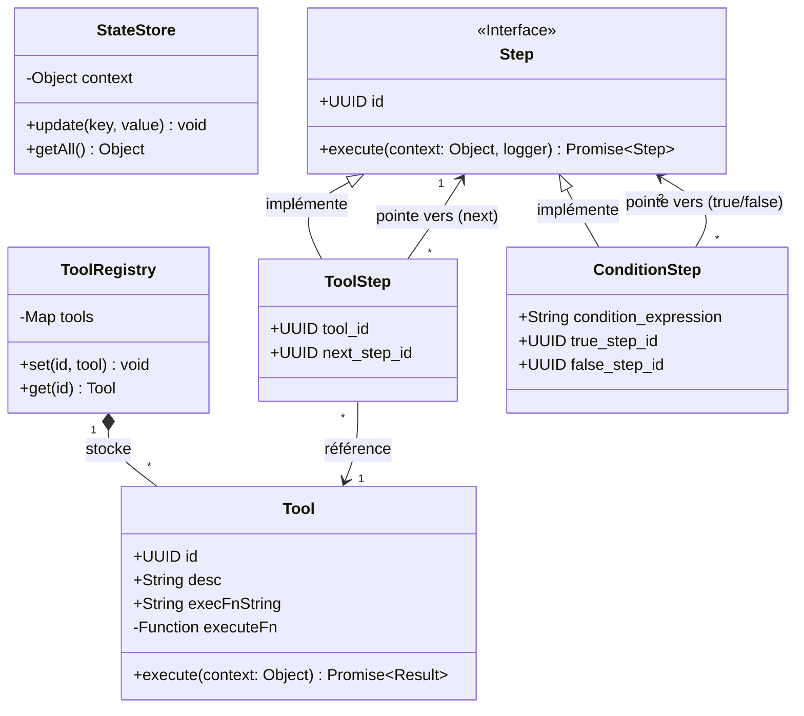
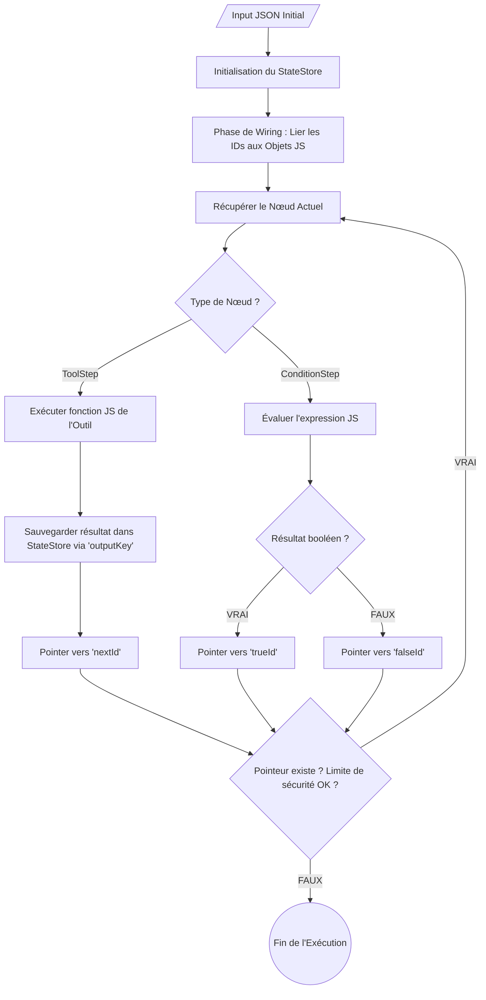
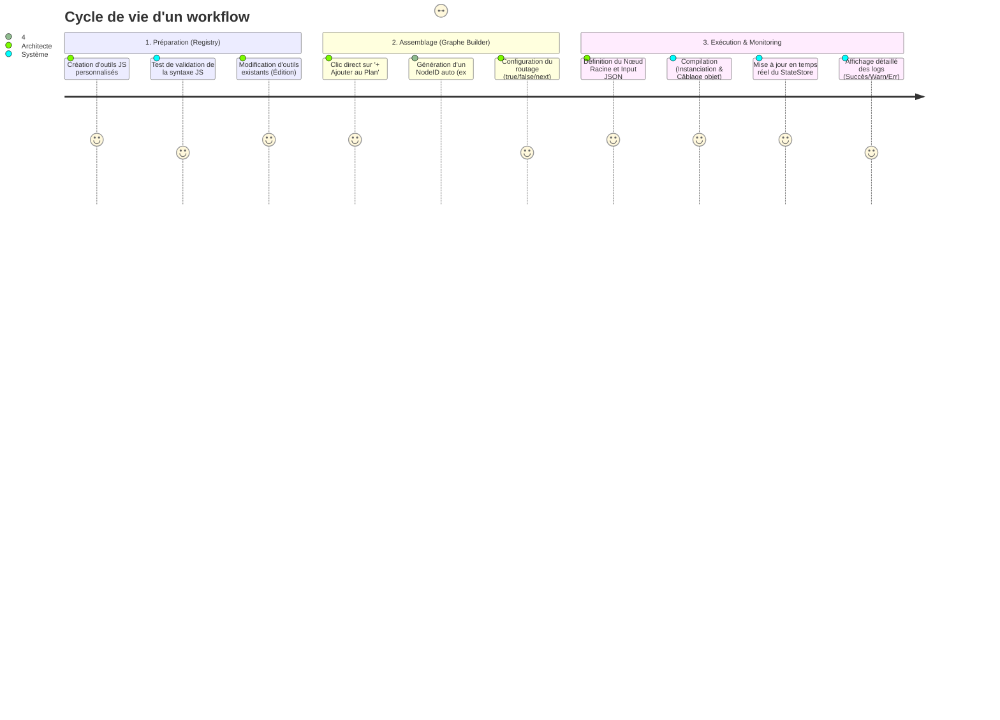

# 🤖 Agentic Framework (V3)

Bienvenue dans la documentation officielle de l'**Agentic Framework V3**. Cette version marque une transition majeure d'une exécution linéaire vers une architecture en **Graphe d'États Dynamique (State Graph)**, plaçant les outils et le routage au cœur du moteur d'orchestration.

---

## 🌟 Philosophie "Tool-First"

L'expérience utilisateur est désormais centrée sur l'approche **Tool-First**. Plutôt que de créer des nœuds vides pour y assigner des fonctions a posteriori, l'architecte visualise d'abord ses capacités globales (le Registre d'outils) et les injecte directement dans son workflow. L'édition du code JavaScript brut des outils se fait à la volée, sans jamais casser la structure du graphe existant.

---

## 🏗️ Architecture du Système

Le système est divisé en trois pôles interactifs :
1. **Le Registre (Tools) :** Création, édition et listage des outils d'action.
2. **Le Graphe Builder :** Assemblage des nœuds et configuration du routage.
3. **Le Moteur d'Exécution (Runner) :** Initialisation du `StateStore`, exécution, monitoring (logs) et import/export JSON.

### Diagramme de Cas d'Utilisation

### Architecture des Classes (Pattern Polymorphe)

Les outils d'action (`ToolStep`) et de routage (`ConditionStep`, `LoopStep`) héritent de la même interface et sont traités sur un pied d'égalité par le moteur.

---

## 🔄 Flux de Travail (Exécution)

Lors du clic sur **Démarrer l'Agent**, le moteur opère en deux phases distinctes :

1. **La Compilation (Wiring) :** Le *Wiring Engine* lit la configuration textuelle de l'UI (les IDs), instancie les objets `Step` en mémoire, et transforme les chaînes de caractères en véritables pointeurs d'objets JavaScript imbriqués.
2. **L'Exécution Dynamique :** Le moteur lance le nœud racine et laisse le graphe s'auto-naviguer jusqu'à sa fin (ou jusqu'à atteindre la limite de sécurité anti-boucle infinie).

---

## 🧩 Composants Clés & Évolutions (V2 vs V3)

| Composant | Rôle dans la V3 | Évolution majeure |
| :--- | :--- | :--- |
| **ToolRegistry** | Catalogue d'outils central. | Interface unifiée. Verrouillage de l'ID lors de l'édition pour garantir l'intégrité du graphe. |
| **Tool** | Logique métier isolée. | Stocke le code JS brut (`execFnString`) permettant l'édition dynamique via l'interface utilisateur. |
| **StateStore** | Mémoire centrale ("cerveau"). | Injecté directement dans l'exécution via l'objet JS global `state`. Permet un accès/mutation via `state.variable`. |
| **Nodes (UI)** | Représentation visuelle du graphe. | Utilisation d'identifiants stricts (`etape_1`) pour un câblage réseau bidirectionnel remplaçant la liste linéaire. |
| **Wiring Engine** | Compilateur pré-exécution. | **Nouveauté :** Rend le graphe 100% autonome en transformant l'UI déclarative en graphe d'objets liés en mémoire. |

---

## 🗺️ Expérience Architecte (User Journey)

L'utilisation du framework suit un parcours fluide, conçu pour l'itération rapide :

