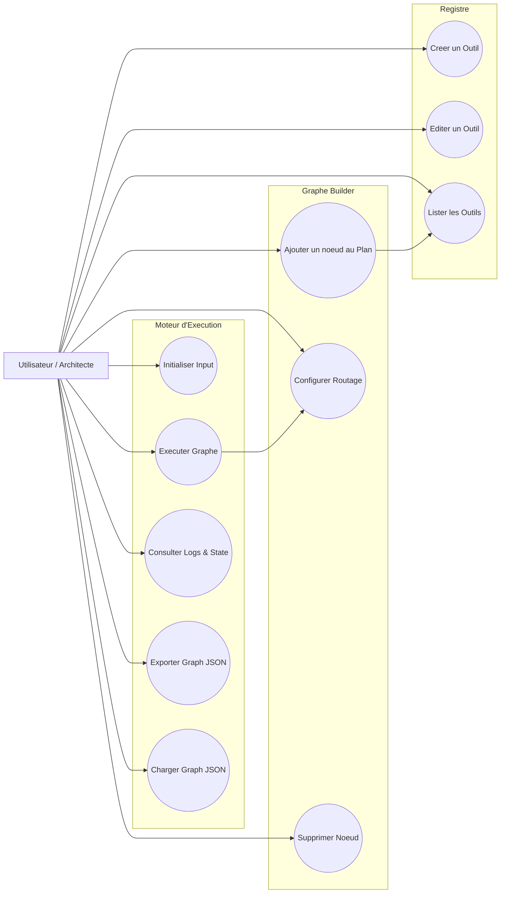
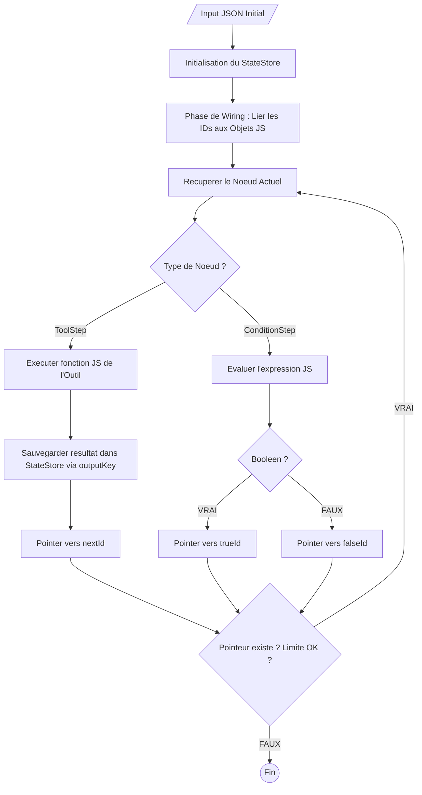
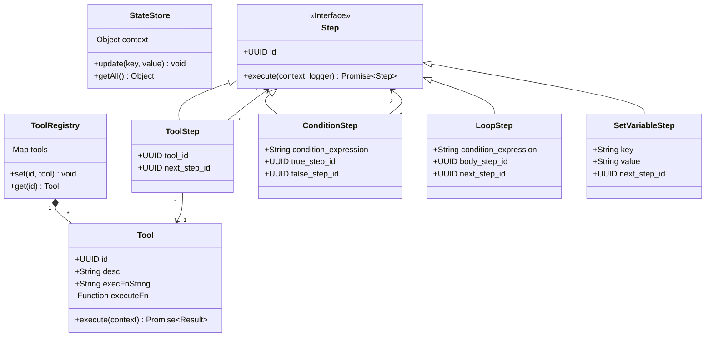

# Agentic Framework V3

Architecture en **Graphe d'Etats Dynamique** pour l'orchestration d'outils IA. L'approche **Tool-First** place les outils et le routage au coeur du moteur.

## Tech Stack

- **Svelte 5** + **TypeScript** - UI reactive
- **Vite 8** - bundler
- **Axios** - requetes HTTP
- **Bun** - runtime & package manager

## Installation

```bash
bun install
```

## Developpement

```bash
bun run dev
```

## Build & Preview

```bash
bun run build
bun run preview
```

## Type Check

```bash
bun run check
```

## Fonctionnalites

- **Registry & Tools** : creation/edition des outils d'action en JS brut, validation de syntaxe.
- **Graphe visual** : noeuds reordonnables (↑/↓), badges de type colores, autocompletion des IDs de routage et des variables du state.
- **Editeur de variable graphique** : le noeud *Variable* permet d'assigner graphiquement une valeur (texte, nombre, booleen, liste, objet JSON) ou de **copier une variable existante / un parametre d'objet** (ex : `state.result.data.title`, `state.list[0]`) vers une nouvelle variable. Apercu en direct.
- **Pilotage du Runner** : etat initial a saisir en formulaire, indicateur d'execution (idle / running / success / error), logs horodates et vue de la memoire (StateStore).
- **Apercu image** : si un resultat contient une URL d'image, elle est affichee directement (ex : photo de chien aleatoire).
- **Notifications** : toasts success/erreur/avertissement a la place des `alert()`.
- **Import/Export** du graphe en JSON.

## Outils fournis

| Outil | Description |
| :--- | :--- |
| `api_request` | Requete HTTP (GET, POST, PUT, DELETE) via `state.url`, `state.method`, `state.headers`, `state.payload`. |
| `add_one` | Incremente `state.count` de 1. |
| `display_image` | Affiche une image depuis `state.imageUrl` ou `state.url` (par defaut : photo de chien aleatoire depuis dog.ceo). |

## Architecture

Le systeme repose sur 3 pokes :

| Composant | Role |
| :--- | :--- |
| **ToolRegistry** | Catalogue d'outils central. Verrouillage de l'ID lors de l'edition. |
| **Tool** | Logique metier isolee. Stocke le code JS brut (`execFnString`) pour edition dynamique. |
| **StateStore** | Memoire centrale. Acces/mutation via `state.variable`. |
| **Wiring Engine** | Compilateur pre-execution. Transforme l'UI declarative en graphe d'objets lies. |

### Types de noeuds

| Noeud | Role | Champs |
| :--- | :--- | :--- |
| **Outil** | Execute une fonction JS du registre et sauvegarde le resultat. | `toolId`, `outputKey`, `nextId` |
| **Condition** | Evalue une expression JS et route vers la branche vrai/faux. | `expr`, `trueId`, `falseId` |
| **Boucle** | Re-execute un corps tant qu'une condition est vraie. | `expr`, `bodyId`, `nextId` |
| **Variable** | Assigne une valeur (ou copie une variable existante) dans le state. | `key`, `value`, `nextId` |

### Diagramme des cas d'utilisation


```mermaid
flowchart LR
    client[Utilisateur / Architecte]

    subgraph Registre
        createTool((Creer un Outil))
        editTool((Editer un Outil))
        viewTools((Lister les Outils))
    end

    subgraph Graphe Builder
        addNode((Ajouter un noeud au Plan))
        configNode((Configurer Routage))
        deleteNode((Supprimer Noeud))
    end

    subgraph Moteur d'Execution
        initPlan((Initialiser Input))
        execPlan((Executer Graphe))
        viewLogs((Consulter Logs & State))
        exportPlan((Exporter Graph JSON))
        loadPlan((Charger Graph JSON))
    end

    client --> createTool
    client --> editTool
    client --> viewTools
    client --> addNode
    client --> configNode
    client --> deleteNode
    client --> initPlan
    client --> execPlan
    client --> viewLogs
    client --> loadPlan
    client --> exportPlan

    addNode --> viewTools
    execPlan --> configNode
```

### Flux d'execution


```mermaid
graph TD
    A[/Input JSON Initial/] --> Init[Initialisation du StateStore]
    Init --> Compiler[Phase de Wiring : Lier les IDs aux Objets JS]
    Compiler --> Fetch[Recuperer le Noeud Actuel]

    Fetch --> CheckType{Type de Noeud ?}

    CheckType -- "ToolStep" --> ExecTool[Executer fonction JS de l'Outil]
    ExecTool --> SaveState[Sauvegarder resultat dans StateStore via outputKey]
    SaveState --> RouteTool[Pointer vers nextId]

    CheckType -- "ConditionStep" --> EvalCond[Evaluer l'expression JS]
    EvalCond --> IsCondTrue{Booleen ?}
    IsCondTrue -- "VRAI" --> RouteTrue[Pointer vers trueId]
    IsCondTrue -- "FAUX" --> RouteFalse[Pointer vers falseId]

    RouteTool --> NextNode
    RouteTrue --> NextNode
    RouteFalse --> NextNode

    NextNode{Pointeur existe ? Limite OK ?}
    NextNode -- "VRAI" --> Fetch
    NextNode -- "FAUX" --> End((Fin))
```

### Diagramme de classes


```mermaid
classDiagram
    direction TB

    class StateStore {
        -Object context
        +update(key, value) void
        +getAll() Object
    }

    class ToolRegistry {
        -Map tools
        +set(id, tool) void
        +get(id) Tool
    }

    class Tool {
        +UUID id
        +String desc
        +String execFnString
        -Function executeFn
        +execute(context) Promise~Result~
    }

    class Step {
        <<Interface>>
        +UUID id
        +execute(context, logger) Promise~Step~
    }

    class ToolStep {
        +UUID tool_id
        +UUID next_step_id
    }

    class ConditionStep {
        +String condition_expression
        +UUID true_step_id
        +UUID false_step_id
    }

    class LoopStep {
        +String condition_expression
        +UUID body_step_id
        +UUID next_step_id
    }

    class SetVariableStep {
        +String key
        +String value
        +UUID next_step_id
    }

    ToolRegistry "1" *-- "*" Tool
    Step <|-- ToolStep
    Step <|-- ConditionStep
    Step <|-- LoopStep
    Step <|-- SetVariableStep
    ToolStep "*" --> "1" Tool
    ToolStep "*" --> "1" Step
    ConditionStep "*" --> "2" Step
```

## Structure du projet

```
src/
  lib/
    components/          # Composants Svelte
      RegistryPanel.svelte      # Registre d'outils + creation de noeuds
      GraphPanel.svelte         # Editeur du graphe (reordonnable)
      SetVariableEditor.svelte  # Editeur graphique de variable
      RunnerPanel.svelte        # Runner, logs, StateStore, apercu image
      ToastContainer.svelte     # Notifications
    domain/engine.ts     # Moteur : Step, compilation, execution
    stores/              # Etat applicatif + toasts
    tools/               # Outils d'action (decouverts automatiquement)
```